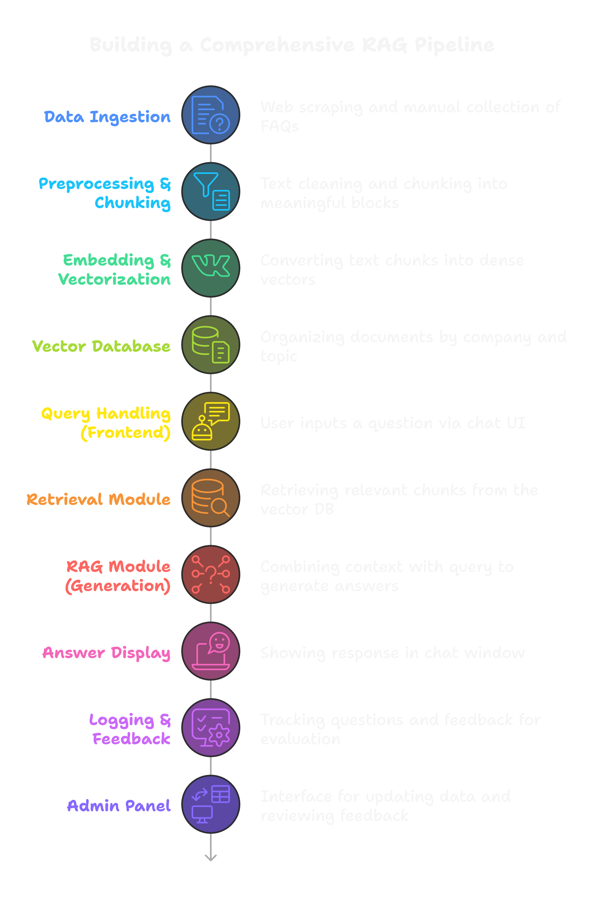

# InstaQuery

## Intelligent RAG-Based FAQ Assistant for Multi-Company Knowledge Integration

InstaQuery is an advanced retrieval-augmented generation (RAG) system designed to provide instant, accurate responses to user queries across multiple company knowledge bases. This solution seamlessly integrates FAQ data from leading platforms like Meesho, Swiggy, Zomato, and other major companies to deliver a unified query resolution experience.

## Project Overview

InstaQuery transforms how users interact with company knowledge bases by leveraging state-of-the-art language models enhanced with retrieval capabilities. The system intelligently searches, retrieves, and synthesizes information from diverse sources to provide contextually relevant answers in real-time.

## RAG Pipeline Architecture



### Comprehensive RAG Pipeline Components:

1. **Data Ingestion**
   - Web scraping and manual collection of FAQs from multiple company sources
   - API integration with supported platforms

2. **Preprocessing & Chunking**
   - Text cleaning and chunking into meaningful blocks
   - Removing irrelevant content and standardizing formats

3. **Embedding & Vectorization**
   - Converting text chunks into dense vectors
   - Using state-of-the-art embedding models

4. **Vector Database**
   - Organizing documents by company and topic
   - Efficient storage and retrieval architecture

5. **Query Handling (Frontend)**
   - User inputs a question via chat UI
   - Query preprocessing and intent recognition

6. **Retrieval Module**
   - Retrieving relevant chunks from the vector DB
   - Semantic search with customizable parameters

7. **RAG Module (Generation)**
   - Combining context with query to generate answers
   - Maintaining source attribution

8. **Answer Display**
   - Showing response in chat window
   - Highlighting source information

9. **Logging & Feedback**
   - Tracking questions and feedback for improvement
   - Performance analytics

10. **Admin Panel**
    - Interface for monitoring data and reviewing feedback
    - Dashboard for system performance

## Key Features

- **Multi-Company Knowledge Integration**: Unified access to FAQs and information from 10+ major platforms
- **Intelligent Query Processing**: Advanced natural language understanding for accurate query interpretation
- **Context-Aware Responses**: Responses tailored to specific company contexts when necessary
- **Seamless Conversation Flow**: Natural dialogue experience with follow-up question handling
- **Scalable Architecture**: Easily expandable to incorporate additional company knowledge bases
- **Performance Analytics**: Comprehensive metrics on query resolution effectiveness

## Technical Stack

- **Frontend**: React with Tailwind CSS
- **Backend**: FastAPI 
- **Vector Database**: Chroma/ FAISS / Pinecone
- **Embedding Models**: OpenAI, Cohere, or open-source alternatives
- **LLM**: GPT-3.5 turbo, Gemini 1.5 pro, Llama3,  open-source models
- **Deployment**: Docker, Kubernetes

## Use Cases

- Customer support automation for e-commerce platforms
- Self-service information access for food delivery services
- Cross-platform knowledge discovery for users with questions about multiple services
- Reducing support ticket volume by providing instant answers to common questions

## Getting Started

```bash
# Clone the repository
git clone https://github.com/yourusername/InstaQuery.git

# Navigate to the project directory
cd InstaQuery

# Install dependencies
pip install -r requirements.txt

# Set up environment variables
cp .env.example .env
# Edit .env with your API keys and configuration

# Run the application
python app.py
```

## Contributing

We welcome contributions to enhance InstaQuery's capabilities. Please see our contribution guidelines for more information on how to participate.

## License

This project is licensed under the MIT License - see the LICENSE file for details.

---

*InstaQuery: Instant insights, intelligent answers.*
